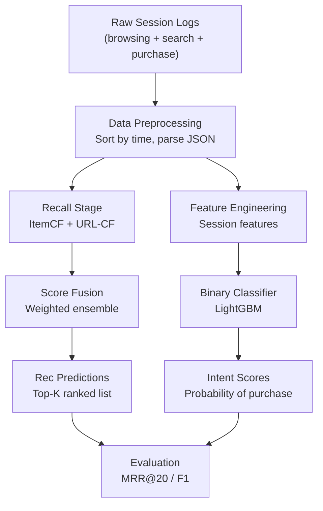

# SIGIR eCOM 2021 Data Challenge — 1st Place Solution: Deep Technical Report

> **Source Repository:** [DeepBlueAI/SIGIR_eCOM_2021_Data_Challenge_1st_Place](https://github.com/DeepBlueAI/SIGIR_eCOM_2021_Data_Challenge_1st_Place)  
> **Team:** DeepBlueAI  
> **Language:** Python | **License:** GPL-3.0

---

## Table of Contents

1. [Competition Overview](#1-competition-overview)
2. [Dataset](#2-dataset)
3. [Repository Structure](#3-repository-structure)
4. [Task 1 — Product Recommendation (`code_rec`)](#4-task-1--product-recommendation-code_rec)
5. [Task 2 — Cart Abandonment Intent Prediction (`code_cart`)](#5-task-2--cart-abandonment-intent-prediction-code_cart)
6. [Shared Utilities & Infrastructure](#6-shared-utilities--infrastructure)
7. [Evaluation Metrics](#7-evaluation-metrics)
8. [End-to-End Pipeline Walkthrough](#8-end-to-end-pipeline-walkthrough)
9. [Key Design Decisions & Insights](#9-key-design-decisions--insights)
10. [Dependency Stack / Tech Stack](#10-dependency-stack--tech-stack)
11. [Lessons for Your Own Project](#11-lessons-for-your-own-project)

---

## 1. Competition Overview

The **SIGIR eCom 2021 Data Challenge** (hosted by Coveo, co-located with SIGIR 2021) focused on **in-session e-commerce intelligence**. Participants tackled two independent tracks:

| Track | Problem | Metric |
|---|---|---|
| **Task 1 — Recommendation** | Given the first *k* events of a shopping session, predict the *next* item(s) the user will interact with | MRR@20 (Mean Reciprocal Rank) |
| **Task 2 — Cart Intent** | Given a session containing an add-to-cart event, predict whether the item will be **purchased** before the session ends | Weighted micro-F1 |

The challenge used real anonymized browsing data from Coveo's e-commerce platform, containing over **30 million fine-grained events** including pageviews, product details, add-to-cart, and purchases, enriched with search queries, clicked results, and product catalog metadata (text embeddings, category, image vectors, price buckets).

---

## 2. Dataset

### Data Files (provided by Coveo)

```
data/
├── train/
│   ├── browsing_train.csv        # Browsing events (user, event_type, action, item, time, url)
│   ├── search_train.csv          # Search events (user, query_vector, clicked_list, resp_list, time)
│   └── sku_to_content.csv        # Product catalog (item, description_vector, category_hash, image_vector, price_bucket)
└── test/
    ├── rec_test_phase_2.json      # Test queries for recommendation task
    └── intention_test_phase_2.json # Test queries for cart intent task
```

### Key Schema Details

**Browsing data columns:**
- `user` — session ID hash (not persistent user ID)
- `event_type` — `pageview`, `event_product`, etc.
- `action` — `detail`, `add`, `purchase`, `view`, etc.
- `item` — product SKU hash
- `time` — Unix timestamp in milliseconds
- `url` — page URL hash

**Search data columns:**
- `user` — session ID hash
- `query_vector` — dense embedding of search query
- `clicked_list` — list of product SKUs clicked after the search
- `resp_list` — list of all products returned in response
- `time` — timestamp

**Product catalog columns:**
- `description_vector` — text embedding
- `category_hash` — product category (label-encoded)
- `image_vector` — visual embedding
- `price_bucket` — bucketed price

### Test Data Format (JSON)

For the rec task:
```json
[
  {
    "query": [
      {
        "session_id_hash": "abc123",
        "product_sku_hash": "item_X",
        "query_vector": null,
        "product_action": "detail",
        "server_timestamp_epoch_ms": 1620000000000
      }
    ],
    "label": ["item_Y", "item_Z"]
  }
]
```

For the cart task, additionally includes `nb_after_add` (events after add-to-cart).

---

## 3. Repository Structure

```
SIGIR_eCOM_2021_Data_Challenge_1st_Place/
│
├── README.md                      # Top-level overview
├── LICENSE                        # GPL-3.0
├── .gitignore
│
├── code_rec/                      # Task 1: Recommendation
│   ├── README.md                  # Solution description for rec task
│   ├── constant.py                # Paths and global config
│   ├── gen_data.py                # Data loading + preprocessing
│   ├── multi_recall.py            # Core recall algorithms (i2i, url2i)
│   ├── evaluation.py              # MRR, F1, weighted micro-F1 metrics
│   ├── utils.py                   # Shared data helpers
│   └── uploader.py                # Submission file generation
│
├── code_cart/                     # Task 2: Cart intent prediction
│   ├── README.md                  # Solution description for cart task
│   ├── constant.py                # Paths and global config
│   ├── gen_data.py                # Cart-specific data loading
│   ├── cart_task.py               # Feature engineering + training pipeline
│   ├── model.py                   # LightGBM wrapper (LGBBinary class)
│   ├── utils.py                   # Shared helpers
│   └── uploader.py                # Submission file generation
│
└── resource/
    └── image-20210625141744024.png  # Architecture diagram used in README
```

> [!NOTE]
> There is **no frontend** in the traditional sense (no web UI, no React app, etc.). The "frontend" of this ML project is the **submission uploader** (`uploader.py`) that generates JSON files compatible with the Coveo leaderboard API. The entire project is an offline ML pipeline.

---

## 4. Task 1 — Product Recommendation (`code_rec`)

### 4.1 High-Level Approach

The team's winning approach is a **two-stage recall + ensemble** pipeline — a classic industrial recommendation architecture:

```
Stage 1: Multi-Strategy Recall
    ├── Strategy A: u2i → i2i (ItemCF similarity)
    └── Strategy B: u2url → url2i (URL collaborative filtering)
                        ↓
Stage 2: Score Fusion & Ranking
                        ↓
Stage 3: Deduplication & Post-processing
                        ↓
Submission Upload
```

The team explicitly notes: _"Our best result is simple and robust, which is just a weighted ensemble of the results of the two recalls."_

### 4.2 Recall Strategy 1: `u2i_interact_i2i_itemcf` (ItemCF-based)

**Concept:** User-to-Item via Item-to-Item Collaborative Filtering.

**Steps:**
1. **Build item-to-item similarity matrix** using collaborative filtering:
   - Count co-occurrences of item pairs across sessions
   - Weight by inverse session size and time decay
   - Normalize to produce similarity scores `w_ij`

2. **For each user session**, look up recently interacted items, find their most similar neighbors (top-150 items per seed item, up to 10–20 seed items)

3. **Weight each candidate** by:
   - **Location weight:** `0.7^j` — more recent interactions get higher weight (exponential decay)
   - **Time weight:** `1 - |qtime - time| / 60000` — prefers items interacted with close in time to query
   - **Similarity weight:** raw ItemCF similarity score `w_ij`
   - **Final rank weight:** `sim_weight × loc_weight × time_weight`

4. **Apply ban list**: items already interacted with (both browsed items and search-clicked items) are excluded from recommendations to avoid re-recommending seen content.

**Key code excerpt from `multi_recall.py`:**
```python
def get_whole_time_wei(df, base_time):
    time_wei = ((base_time - time_list) // pd.Timedelta('1day')) + 1
    time_wei = 1 - time_wei / 100
    time_wei = np.log(time_wei) + 1          # log-compression of time decay
    time_wei[time_wei < 0.1] = 0.1           # floor at 0.1

def u2i_interact_rec(..., loc_coff=0.7, ...):
    for j, item in enumerate(interacted_items[:-recall_max_road_num-1:-1]):
        loc_weight = 0.7 ** j                # recent items weighted more
        time_weight = (1 - abs(qtime - time) / 60000)
        rank_weight = sim_weight * loc_weight * time_weight
```

### 4.3 Recall Strategy 2: `u2url_url2i_urlcf` (URL-based CF)

**Concept:** User-to-URL via URL-to-Item collaborative filtering.

**Steps:**
1. Build **URL-to-item co-occurrence matrix** from session logs (items viewed from each URL)
2. Look up URLs a user visited → find items that co-occur with those URLs → score candidates
3. Apply the same location/time weighting as Strategy 1

**Why URL signals?** URLs in e-commerce typically encode category or navigation context (e.g., `/shoes/running/`). Items viewed from the same URL path are likely to be substitutes — this gives a category-level collaborative signal not captured by pure item-level CF.

### 4.4 Ensemble / Score Fusion

The two recall lists are merged by summing weighted scores. Items appearing in both lists get their scores combined. The team noted they tried many other recall methods (embeddings, matrix factorization, etc.) but the above two simple signals were most effective.

Key config in `constant.py`:
```python
cur_mode = 'online'   # 'local' for validation, 'online' for submission
cur_used_recall_source = 'u2i_interact_i2i_itemcf_w02-u2url_url2i_urlcf'
```

### 4.5 Data Preprocessing (`gen_data.py`)

```python
# Load raw CSVs
train_browsing = pd.read_csv('browsing_train.csv')
# Columns: user, event_type, action, item, time, url
train_search = pd.read_csv('search_train.csv')
# Sort chronologically per user
train_browsing = train_browsing.sort_values(by=['user', 'time'])

# For test sessions, parse JSON:
with open('rec_test_phase_2.json') as f:
    rec_test = json.loads(f.read())
# Extract session_id, product_sku_hash, query_vector, server_timestamp_epoch_ms
```

The code distinguishes three types of records:
- **Item interactions**: `product_sku_hash` is not null
- **Search events**: `query_vector` is not null
- **Null events**: both are null (tracked but excluded from recall)

**Local validation split:** The training set is re-structured to mimic the test format — the last interaction per session becomes the label, and all preceding interactions form the query.

### 4.6 Local vs Online Mode

| Mode | Data | Purpose |
|------|------|---------|
| `local` | Simulated test split from training data | Cross-validation & metric tracking |
| `online` | Actual test JSON from competition | Final submission |

---

## 5. Task 2 — Cart Abandonment Intent Prediction (`code_cart`)

### 5.1 Problem Definition

Given a session that contains an `add` action (add-to-cart), predict whether the added item will be **purchased** before the session ends.

- **Label = 1**: item purchased (positive class)
- **Label = 0**: item abandoned in cart (negative class, dominant)
- **Challenge**: Severe label imbalance — accuracy alone is misleading (even all-zero submissions score well)

### 5.2 High-Level Architecture

```
Raw JSON/CSV Data
       ↓
gen_data.py: Parse + Structure Sessions
       ↓
cart_task.py: Feature Engineering
       ↓
model.py: LightGBM Binary Classifier (LGBBinary)
       ↓
uploader.py: Generate Submission JSON
```

### 5.3 Data Parsing (`gen_data.py`)

```python
def gen_online_data():
    with open('intention_test_phase_2.json') as f:
        rec_test = json.loads(f.read())
    for items in rec_test:
        nb_after_add = items['nb_after_add']  # events after add-to-cart
        for seq in items['query']:
            if seq['product_action'] == 'purchase':
                purchase_num += 1
            if seq['product_action'] == 'add':
                first_add_product = seq['product_sku_hash']
```

**Key parsed fields per session:**
- `nb_after_add` — number of browsing events after the add-to-cart event
- `first_add_product` — the SKU that was added to cart (the item to classify)
- Sequence of all actions before/during/after the add

Product catalog is loaded and merged:
```python
df_product = pd.read_csv('sku_to_content.csv')
# Encodes: category_hash, price_bucket (as float32)
```

### 5.4 Feature Engineering (`cart_task.py`)

This is the most creative part of the solution. Features are crafted around the add-to-cart event as the **pivot point**:

```python
df_train['cur_user_idx'] = df_train.groupby('user')['user'].cumcount() + 1
user_first_add_idx_dict = df_train[df_train['action']=='add'].groupby('user')['cur_user_idx'].min()
```

**Feature categories:**

#### A. Detail-page engagement features
```python
def feat_detail_action(df, df_train):
    # How many times user viewed product detail page for the added item:
    #   - BEFORE add-to-cart (left side)
    #   - AFTER add-to-cart (right side)
    feat['detail_count_left']  # signals deliberation before adding
    feat['detail_count_right'] # signals buyer's remorse or re-checking

    # Same for OTHER items (distraction signal):
    feat['other_detail_count_left']
    feat['other_detail_count_right']

    # Ratio features (normalize by session length):
    feat['detail_count_ratio_left'] = feat['detail_count_left'] / (feat['detail_count_left'] + ε)
```

Key insight: _If a user views a product's detail page multiple times before adding, they are more likely to purchase. If they view many OTHER items' detail pages after adding, they are less likely to purchase (exploring alternatives)._

#### B. Temporal features
```python
df_train['browing_time'] = -df_train.groupby('user')['time'].diff(-1)
# Time gap between consecutive events — long gaps may signal abandonment
```

#### C. Session-level features
- Total events before add (`nb_before_add`)
- Session length after add (`nb_after_add` from test JSON)
- Number of unique items browsed

#### D. Product metadata features (from `sku_to_content.csv`)
- `category_hash` — item category
- `price_bucket` — price range of the added item

### 5.5 Model — LightGBM Binary Classifier (`model.py`)

```python
class LGBBinary:
    def __init__(self):
        self.params = {
            "objective": "binary",
            'metric': 'auc',
            'max_depth': 7,
            'eta': 0.03,             # conservative learning rate
            'max_bin': 255,
            'min_child_samples': 20,
            'feature_fraction': 0.9, # column subsampling
            'bagging_fraction': 0.9, # row subsampling
            'num_leaves': 32,
            'verbose': -1
        }
        self.num_boost_round = 1000
```

**Training protocol:**
- Uses `lgb.Dataset` for memory-efficient training
- Supports early stopping via `grow_boost_round = 200`
- Tracks AUC on validation split
- Outputs probability scores (not binary predictions) for the final submission

**Why LightGBM?**
- Handles tabular feature engineering output directly
- Fast training on moderate-sized datasets
- Built-in support for imbalanced binary classification
- No need for neural network complexity given the feature-rich input

### 5.6 Label Imbalance Strategy

The cart README explicitly states:
> _"The local score is inconsistent with the online score due to the imbalance of the label and accuracy metric (all zeros submission can still achieve a good accuracy). After a great effort of feature engineering, we finally selected those features that are consistent between local and online."_

This means the team:
1. Could NOT rely on local accuracy as a guide
2. Had to focus on features that produce consistent **rank ordering** (AUC)
3. Used the online leaderboard as additional feedback
4. Selected features based on online vs local consistency

---

## 6. Shared Utilities & Infrastructure

### `uploader.py` (shared between both tasks)

This script formats the model outputs into the competition's submission format and uploads them. It handles:
- Converting ranked item lists to JSON format
- Truncating to top-K predictions
- Serializing predictions per session

### `constant.py` (per task)

Defines all filesystem paths:
```python
data_dir = '../data/'
prediction_result = '../prediction_result/'
user_data_dir = '../user_data_rec/'   # intermediate computation caches
init_dir = '../init_data/'
```

Intermediate results (similarity matrices, preprocessed DataFrames) are saved as `.pickle` files under `user_data_*` directories to avoid recomputation.

---

## 7. Evaluation Metrics

### Task 1: `mrr_at_k` (Mean Reciprocal Rank)

```python
def mrr_at_k(preds: list, labels: list, topK: int):
    converted_preds = convert_list_to_top_K(preds, topK)   # truncate to top-K
    for p, l in zip(converted_preds, labels):
        next_item = l[0]                                     # ground truth = first future item
        if next_item not in p:
            rr.append(0.0)
        else:
            rr.append(1.0 / (p.index(next_item) + 1))       # 1/rank
    return sum(rr) / len(labels)                             # mean
```

MRR@20 means: for each session, the model scores `1/rank` if the true next item appears in the top-20 predictions, and 0 otherwise.

### Task 1: `f1_at_k` (for all future items sub-track)

```python
def f1_at_k(preds, labels, topK):
    # precision = hits / topK
    # recall = hits / |ground truth|
    # f1 = harmonic mean
```

### Task 2: `weighted_micro_f1`

A custom F1 that weights each session's prediction contribution by session size or recency. Implementation is in `evaluation.py`.

---

## 8. End-to-End Pipeline Walkthrough

### Task 1 (Recommendation) — Full Pipeline

```
Step 1: Setup
  constant.py → set data_dir, mode='online'

Step 2: Data Preprocessing
  gen_data.py:
    → gen_local_data_by_testdata()
    → Load browsing_train.csv + search_train.csv
    → Parse rec_test_phase_2.json
    → Merge into unified session DataFrame
    → Save: df_local.pickle, df_online.pickle

Step 3: Similarity Matrix Computation (multi_recall.py)
  → For ItemCF:
      Iterate all session pairs
      Compute weighted co-occurrence counts
      Normalize → sim_item_corr dict
  → For URL-CF:
      Compute URL-to-item co-occurrence
      Normalize → sim_url_corr dict

Step 4: Recall Generation (multi_recall.py)
  → For each test session user:
      get_ban_item() → items already seen
      u2i_interact_rec() → candidate items from ItemCF
      u2url_url2i_rec() → candidate items from URL-CF
      Merge scores

Step 5: Ensemble & Rank
  → Combine both recall lists
  → Sum scores for duplicate items
  → Sort by final score descending

Step 6: Evaluate Locally
  evaluation.py → mrr_at_k(preds, labels, topK=20)

Step 7: Upload
  uploader.py → generate JSON, submit
```

### Task 2 (Cart Intent) — Full Pipeline

```
Step 1: Data Parsing
  gen_data.py:
    → init_product() → df_product.pickle
    → gen_online_data() → parse intention_test_phase_2.json
    → gen_local_data() → local validation split from training data
    → Save: df_online.pickle, df_local.pickle, df_train_online.pickle, df_train_local.pickle

Step 2: Feature Engineering
  cart_task.py:
    → Load df_local, df_online, df_train, df_product
    → Set session action index (cur_user_idx)
    → Find first add-to-cart event per session
    → feat_detail_action() → engagement features around add event
    → Temporal features (browsing_time diffs)
    → Merge product metadata

Step 3: Train LightGBM
  model.py → LGBBinary:
    → lgb.Dataset(X_train, label=y_train)
    → lgb.train(params, num_boost_round=1000)
    → Evaluate with AUC

Step 4: Predict & Submit
  cart_task.py → model.predict(X_test) → probabilities
  uploader.py → format, submit
```

---

## 9. Key Design Decisions & Insights

### 9.1 No Deep Learning for Recommendations

Despite the availability of BERT4Rec, SASRec, and other transformer-based sequential recommenders, the team chose **pure collaborative filtering** with handcrafted temporal weighting. Reasons:
- Competition test sessions are short (in-session = single visit, not long-term history)
- Training data from a different distribution than test data
- ItemCF generalizes better to cold-start sessions where neural models overfit seen items
- Much faster iteration cycles

### 9.2 Dual Signal Sources (Item + URL)

Combining item-level and URL-level co-occurrence captures **two complementary signals**:
- **Item-CF**: "users who interacted with X also interacted with Y" (behavioral similarity)
- **URL-CF**: "items appearing on the same page/category are substitutes" (structural similarity)

### 9.3 Temporal Weighting with Floors

The time decay uses a **log-compressed** schedule with a minimum floor (0.1):
```python
time_wei = np.log(time_wei) + 1
time_wei[time_wei < 0.1] = 0.1
```
This prevents very old interactions from having zero weight while still prioritizing recent behavior.

### 9.4 Location-Based Decay

The `0.7^j` position weight ensures recent interactions contribute more than older ones in the same session. This is a simple but effective form of session position encoding.

### 9.5 Adaptive Ban List

Items already seen/searched by the user are explicitly **banned** from recommendations:
```python
ban_product = cur_sess_product_dict.copy()
for sess, prods in search[['user', 'clicked_list']].values:
    new_bans = list(set(ban_product[sess]) | set(prods))
```
This includes both explicitly interacted items AND search-result items that were seen but not clicked — a subtle but important distinction.

### 9.6 Cart Task: Feature Consistency over Local Score

The cart team discovered that features improving **local AUC** did not always improve the **online leaderboard score** due to label distribution differences. Their strategy:
- Prioritize features with consistent behavior across both local and online splits
- Trust the online leaderboard more than local AUC for feature selection

### 9.7 Pickle-Based Intermediate Caching

All large intermediate results (similarity matrices, processed DataFrames) are cached as `.pickle` files to avoid recomputation across runs. This is a practical engineering pattern for iterative data science workflows.

---

## 10. Dependency Stack / Tech Stack

### Core Libraries

| Library | Purpose |
|---------|---------|
| `pandas` | DataFrame manipulation, joins, groupbys |
| `numpy` | Array operations, vectorized math |
| `lightgbm` | Gradient boosting classifier (cart task) |
| `scikit-learn` | `train_test_split`, `metrics`, `roc_auc_score` |
| `tqdm` | Progress bars in loops |
| `matplotlib` / `seaborn` | Feature importance visualization |
| `collections.defaultdict` | Similarity matrix storage |
| `json` | Parse test JSON files |
| `pickle` | Serialize intermediate results |

### Python Version

Python 3.x (3.6+ implied by f-strings and type hints in evaluation.py)

### No Frontend Stack

This project is a **pure backend ML pipeline** — there is no web server, no REST API, no React/Vue frontend, no database. The "user interface" is:
1. Python scripts run from the command line
2. A Slack-based leaderboard for the competition

---

## 11. Lessons for Your Own Project

Here's a synthesis of the most actionable takeaways for building a similar eCommerce session-based recommender or intent predictor:

### Architecture Planning



### Key Takeaways

1. **Start simple with ItemCF before trying deep learning** — especially for short sessions, collaborative filtering often outperforms neural approaches because it doesn't overfit to the training distribution.

2. **Multi-signal recall beats single-signal recall** — combine complementary signals (item-level, URL-level, category-level, embedding-level) and fuse their scores.

3. **Temporal and positional weighting matters a lot** — recency is a strong signal in session-based recommendation. Use exponential decay by both position (`0.7^j`) and time (`1 - Δt/T`).

4. **Always build a ban list** — exclude already-seen items from recommendations. Include search-result impressions in the ban list, not just explicit clicks.

5. **Feature engineering around the key event** — for intent prediction, engineer features relative to the pivot event (add-to-cart). Measure behavior BEFORE and AFTER separately.

6. **Cache aggressively** — similarity matrices and preprocessed sessions are expensive to compute. Use `.pickle` or `parquet` to save intermediate results.

7. **Local vs online consistency** — when local scores disagree with online leaderboard scores (due to label imbalance or distribution shift), prioritize features that perform consistently on both.

8. **Local/online mode toggle** — maintain a `mode` flag in constants to switch between cross-validation and final submission pipelines cleanly.

9. **The LightGBM "default" works** — for tabular binary classification with good feature engineering, LightGBM with default hyperparameters + AUC metric is a very strong baseline.

10. **No frontend needed for ML pipelines** — spend time on data quality, feature engineering, and model validation rather than building UIs unless explicitly required.

---

*Report generated from source analysis of the [DeepBlueAI/SIGIR_eCOM_2021_Data_Challenge_1st_Place](https://github.com/DeepBlueAI/SIGIR_eCOM_2021_Data_Challenge_1st_Place) repository and supplementary competition documentation.*
